# Clean Architecture - Apuntes de Curso

Este documento recopila y estructura los conceptos clave sobre Clean Architecture, basándose en el curso de _Dometrain_. Se centra en la separación de responsabilidades, la independencia de la base de datos y la mantenibilidad del software.

## 1. Evolución de los Patrones de Arquitectura

Antes de llegar a Clean Architecture, es importante entender de dónde venimos y qué problemas intentamos resolver. La arquitectura de software ha evolucionado significativamente a lo largo de las décadas, buscando soluciones a los desafíos de escalabilidad, mantenibilidad y complejidad creciente de los sistemas.

### Principales Patrones de Arquitectura

#### **N-Tier / Layered Architecture (Arquitectura por Capas)**
La arquitectura clásica por capas fue durante mucho tiempo el estándar de facto. Organiza el código en capas horizontales (Presentación, Lógica de Negocio, Acceso a Datos), donde cada capa solo puede comunicarse con la capa inmediatamente inferior. Aunque simple de entender, tiene limitaciones importantes que veremos más adelante.

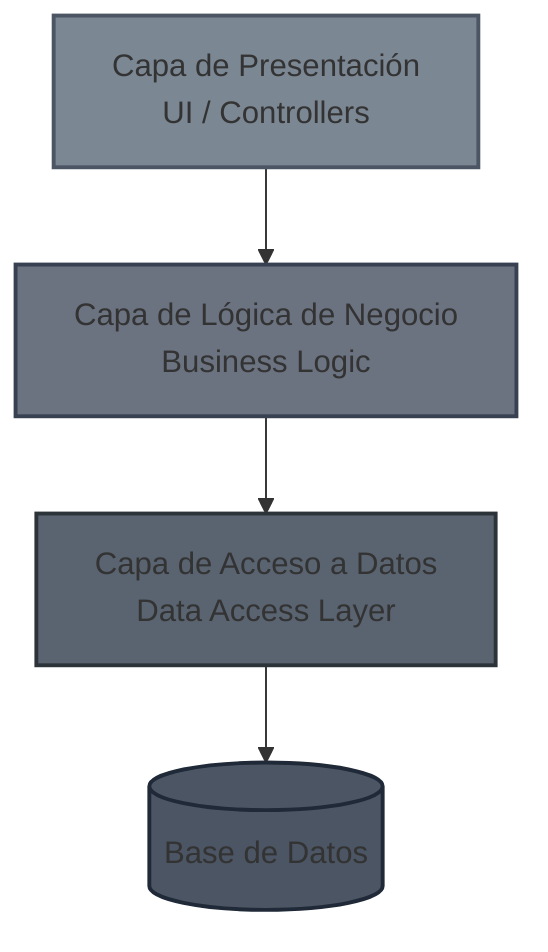

**Ventajas:** Separación clara de responsabilidades, fácil de entender.  
**Desventajas:** Dependencias rígidas hacia abajo, la base de datos se convierte en el centro, difícil de testear.

#### **Microservices Architecture (Arquitectura de Microservicios)**
Divide la aplicación en servicios pequeños, independientes y desplegables por separado. Cada microservicio posee su propia base de datos y se comunica con otros a través de APIs (REST, gRPC, mensajería).

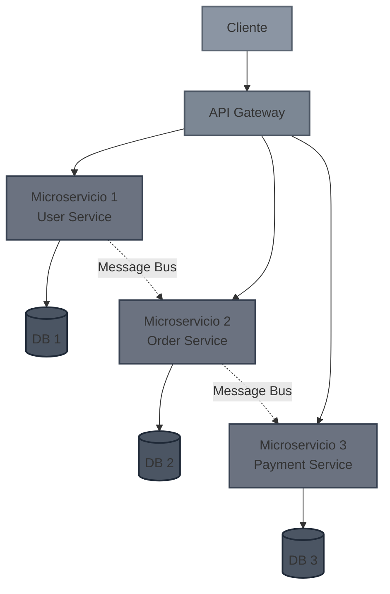

**Ventajas:** Escalabilidad independiente, tecnologías heterogéneas, equipos autónomos.  
**Desventajas:** Complejidad operacional, transacciones distribuidas, consistencia eventual.

#### **Service-Oriented Architecture (SOA)**
Precursor de los microservicios, SOA organiza la funcionalidad en servicios reutilizables que se comunican mediante protocolos estándar (SOAP, XML). A diferencia de los microservicios, SOA tiende a tener servicios más grandes y mayor acoplamiento a través de un Enterprise Service Bus (ESB).

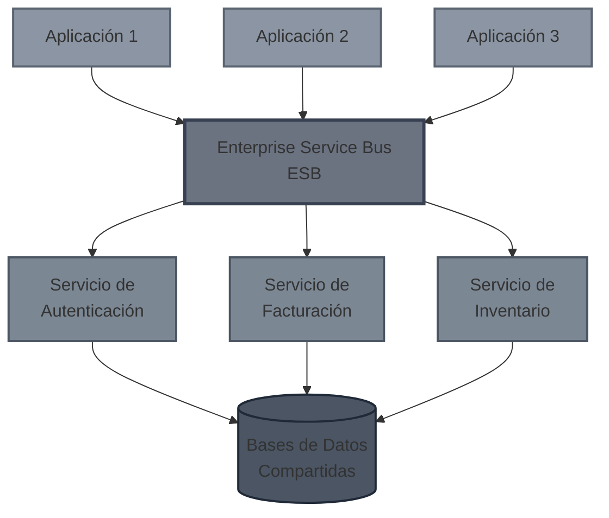

**Ventajas:** Reutilización de servicios, integración empresarial.  
**Desventajas:** ESB como punto único de fallo, complejidad en la orquestación.

#### **Modular Monolith (Monolito Modular)**
Un enfoque híbrido que mantiene todos los módulos en un solo proceso (monolito) pero con límites claros y bien definidos entre módulos. Es un paso intermedio hacia los microservicios sin su complejidad operacional.

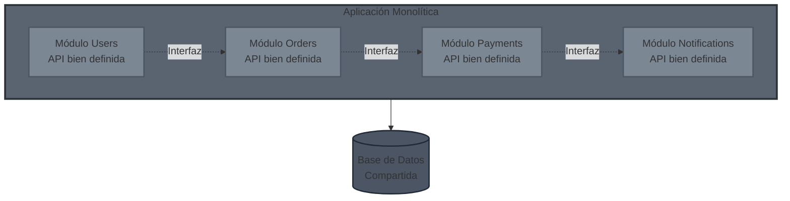

**Ventajas:** Simplicidad de despliegue, transacciones ACID, refactorización más sencilla.  
**Desventajas:** Escalado vertical, posible degradación hacia un "big ball of mud" si no se mantiene la disciplina.

#### **Event Driven Architecture (Arquitectura Basada en Eventos)**
Los componentes se comunican mediante eventos asíncronos. Un productor publica eventos y los consumidores reaccionan a ellos sin conocerse mutuamente. Muy útil en sistemas reactivos y de alta concurrencia.

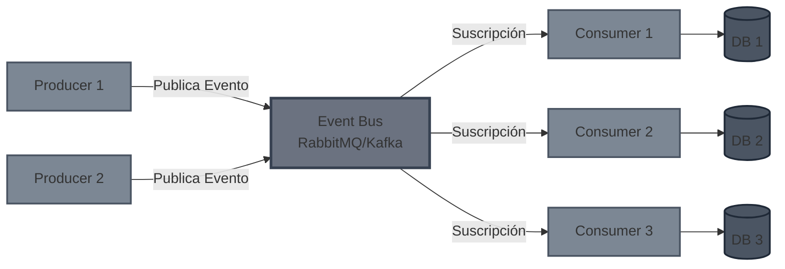

**Ventajas:** Desacoplamiento temporal, escalabilidad, resiliencia.  
**Desventajas:** Debugging complejo, eventual consistency, gestión de sagas.

#### **MV Patterns (MVC, MVP, MVVM)**
Patrones de presentación que separan la lógica de interfaz de usuario de la lógica de negocio:

-   **MVC (Model-View-Controller):** El controlador maneja la entrada del usuario, actualiza el modelo y selecciona la vista.
-   **MVP (Model-View-Presenter):** El presentador actúa como intermediario entre vista y modelo, haciendo la vista más pasiva.
-   **MVVM (Model-View-ViewModel):** El ViewModel expone datos del modelo en un formato que la vista puede enlazar fácilmente (data binding).

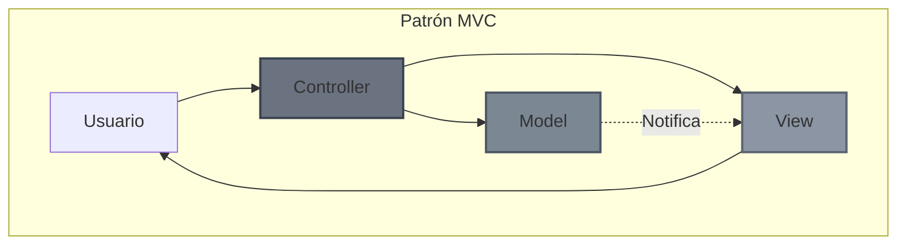
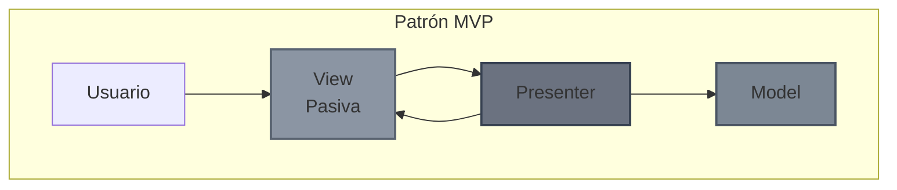
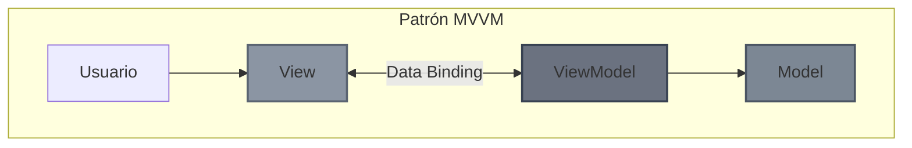

Estos patrones son complementarios a las arquitecturas de sistema y se enfocan específicamente en la capa de presentación.

### El problema de la Arquitectura por Capas (N-Tier)

En la arquitectura tradicional de 3 capas (Tier 1, 2, 3), las dependencias fluyen hacia abajo, generalmente terminando en la base de datos.

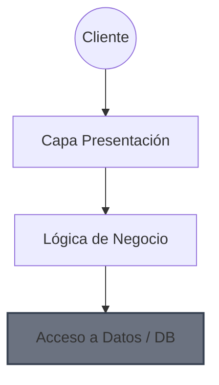

**El gran inconveniente:** Todas las flechas acaban apuntando a la Base de Datos. Con el tiempo, esto provoca que el acceso a datos se mezcle con la lógica de negocio e incluso con la presentación. Los **DATOS** se convierten en el centro de la arquitectura, en lugar de serlo la **LÓGICA DE NEGOCIO**.

## 2. Arquitecturas Centradas en el Dominio

El objetivo de las arquitecturas modernas es invertir las dependencias. Queremos que la **Lógica de Negocio (Dominio)** sea el núcleo y no dependa de nada externo (ni UI, ni BD, ni Frameworks).

Variantes principales:

-   **Clean Architecture** (Robert C. Martin)
    
-   Hexagonal Architecture (Ports and Adapters)
    
-   Onion Architecture
    

### Estructura de Clean Architecture

Las capas interiores definen interfaces (el "qué") y las capas exteriores definen la implementación (el "cómo").

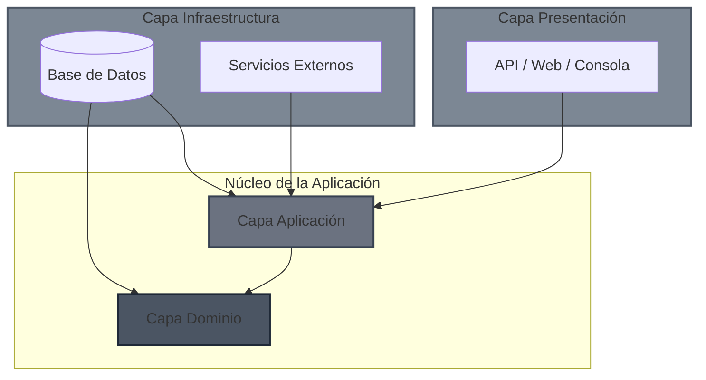

> **Regla de Dependencia:** El código fuente solo puede apuntar hacia adentro. El Dominio no sabe nada de la Infraestructura.

## 3. Desglose de Capas

Este diagrama ilustra la relación entre las capas lógicas y la estructura física de proyectos recomendada en el curso (Sección 0020), destacando la separación de los contratos.


## 🏗️ Clean Architecture (Arquitectura Limpia)

Este diagrama representa la jerarquía y el flujo de dependencias de una aplicación bajo los principios de Arquitectura Limpia, donde las flechas apuntan **hacia dentro**, hacia las capas más estables y de alto nivel (el Dominio). 

[Image of the Clean Architecture Onion Diagram]

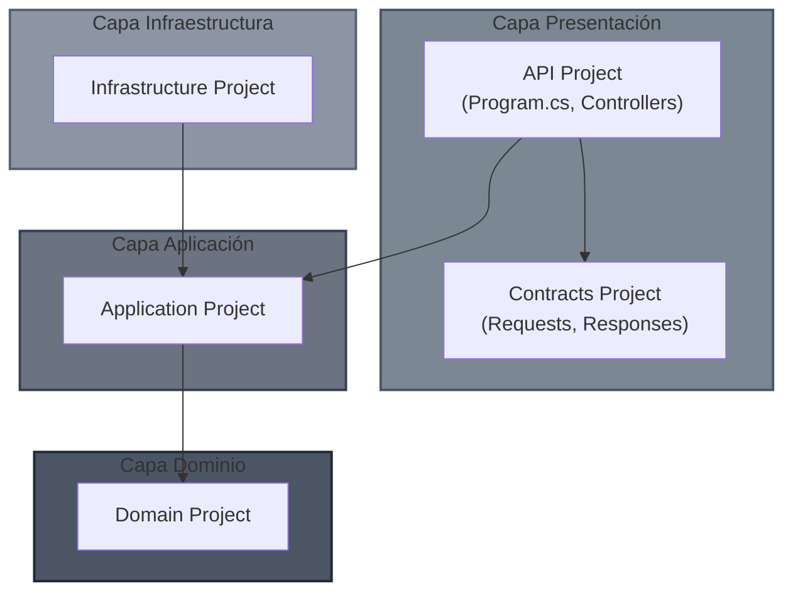

### A. Capa de Presentación (Presentation Layer)

Es el punto de entrada al sistema.

-   **Responsabilidades:** Interactuar con el exterior, visualizar datos, traducir datos (DTOs) y administrar la configuración del framework (ej. ASP.NET Core).
    
-   **Estructura:** Se recomienda separar los contratos (Requests/Responses) en un proyecto o librería aparte.
    

**¿Por qué separar los contratos?** Permite empaquetar `Contracts` (ej. un paquete NuGet) para que los clientes (Frontend, otros microservicios) puedan consumirlos sin depender de la API completa.

**Ejemplo de Estructura:**

-   `GymManagement.Api` (Proyecto WebAPI)
    
-   `GymManagement.Contracts` (Class Library - Solo DTOs)
    

### B. Capa de Aplicación (Application Layer)

Contiene la lógica de los casos de uso. Orquesta el flujo de información.

-   **Responsabilidades:**
    
    1.  Ejecutar casos de uso.
        
    2.  Obtener objetos del Dominio (Fetch).
        
    3.  Manipular objetos del Dominio (Lógica de negocio pura).
        
    4.  Guardar cambios (Persistencia).
        

### C. Capa de Infraestructura (Infrastructure Layer)

Se encarga de todo lo que es "detalle de implementación" y comunicación con el mundo físico.

-   Base de datos (EF Core, Dapper).
    
-   Servicios externos (Stripe, SendGrid).
    
-   Sistema de archivos, Reloj del sistema, etc.
    

## 4. Inyección de Dependencias (DI) en Clean Arch

Existe un desafío: La API (Presentación) necesita inyectar servicios definidos en `Application` pero implementados en `Infrastructure`. Sin embargo, para mantener la arquitectura limpia, no deberíamos acoplar fuertemente la API a la Infraestructura.

**Solución: Extension Methods para DI** Cada capa es responsable de definir su propia inyección de dependencias.

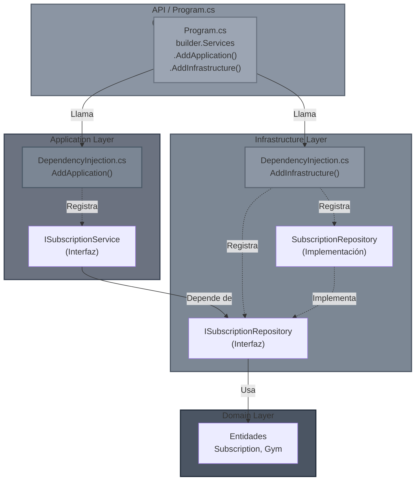

> **Principio clave:** La API (Composition Root) es el único lugar que conoce todas las capas. Cada capa registra sus propias dependencias a través de Extension Methods, manteniendo la separación de responsabilidades.

#### 1. En la capa de Aplicación (`DependencyInjection.cs`)

```
// Proyecto: Application
using Microsoft.Extensions.DependencyInjection;

public static class DependencyInjection
{
    public static IServiceCollection AddApplication(this IServiceCollection services)
    {
        // Registrar servicios propios de la capa de aplicación
        services.AddScoped<ISubscriptionService, SubscriptionService>();
        
        // Registrar MediatR u otros validadores aquí
        return services;
    }
}

```

#### 2. En la capa de Infraestructura (`DependencyInjection.cs`)

```
// Proyecto: Infrastructure
using Microsoft.Extensions.DependencyInjection;

public static class DependencyInjection
{
    public static IServiceCollection AddInfrastructure(this IServiceCollection services)
    {
        // Aquí es donde la implementación concreta se une a la interfaz
        services.AddScoped<ISubscriptionRepository, SubscriptionRepository>();
        services.AddScoped<IEmailSender, SendGridEmailSender>();
        
        return services;
    }
}

```

#### 3. En la API (`Program.cs`)

El punto de entrada es el único lugar donde se permite "conocer" todas las capas para ensamblarlas.

```
var builder = WebApplication.CreateBuilder(args);

// Una sola línea por capa mantiene el Program.cs limpio
builder.Services
    .AddApplication()
    .AddInfrastructure(); 

var app = builder.Build();
app.Run();

```

#### A tener en cuenta:

> **¡OJO!** Se podría pensar que se viola el principio de responsabilidades únicas de las capas, ya que la capa de ```INFRAESTRUCTURA``` debe ser referenciada por la capa de ```PRESENTACIÓN```, pero esto se hace únicamente por la inyección de dependencias. Se debe evitar a toda cosa utilizar cualquier otra referencia de la capa de infraestructura en la capa de presentación. Es por ello que se suele optar por soluciones como declarar pública la clase ```DependencyInjection``` e internal cualquier otra.

## 5. Patrones Tácticos

### CQRS (Command Query Responsibility Segregation)

Separa las operaciones de lectura de las de escritura.

-   **Commands:** Escriben datos. Mutan el estado. Generalmente devuelven `void` o el ID del recurso creado.
    
-   **Queries:** Leen datos. No mutan el estado. Devuelven datos (DTOs).

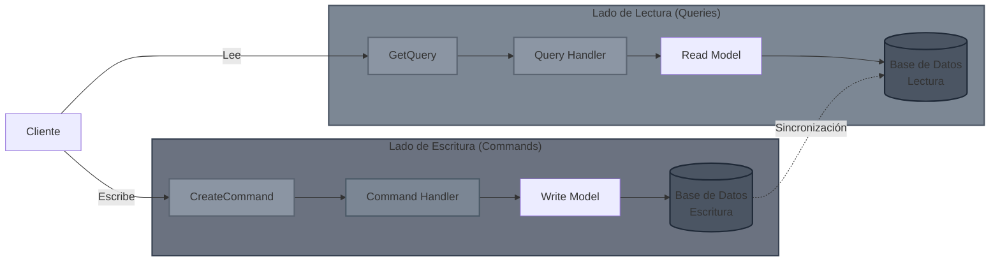
    

> **Nota:** No confundir con CQS (Command Query Separation) que es a nivel de método. CQRS es a nivel de arquitectura/objetos.

### Patrón Mediator

Desacopla los controladores de los servicios. El controlador envía un mensaje y un "mediador" busca quién debe manejarlo.

-   Favorece: **Slice by Feature** (organizar carpetas por funcionalidad: `CreateSubscription`, `GetSubscription`) en lugar de por tipo técnico (`Controllers`, `Services`).
    

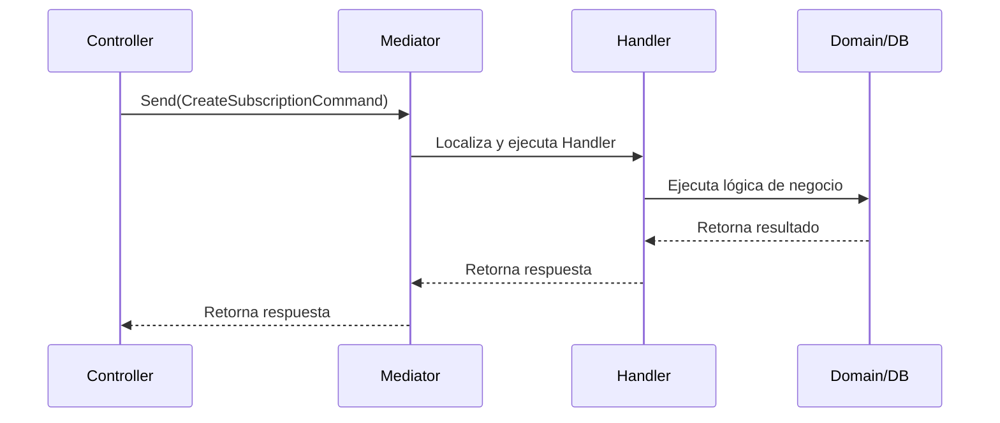

### Patrón Result

Evitar el uso de Excepciones para el flujo de control lógico. Las excepciones son para errores inesperados. Para validaciones o reglas de negocio, usamos un objeto `Result` (o bibliotecas como `ErrorOr`).

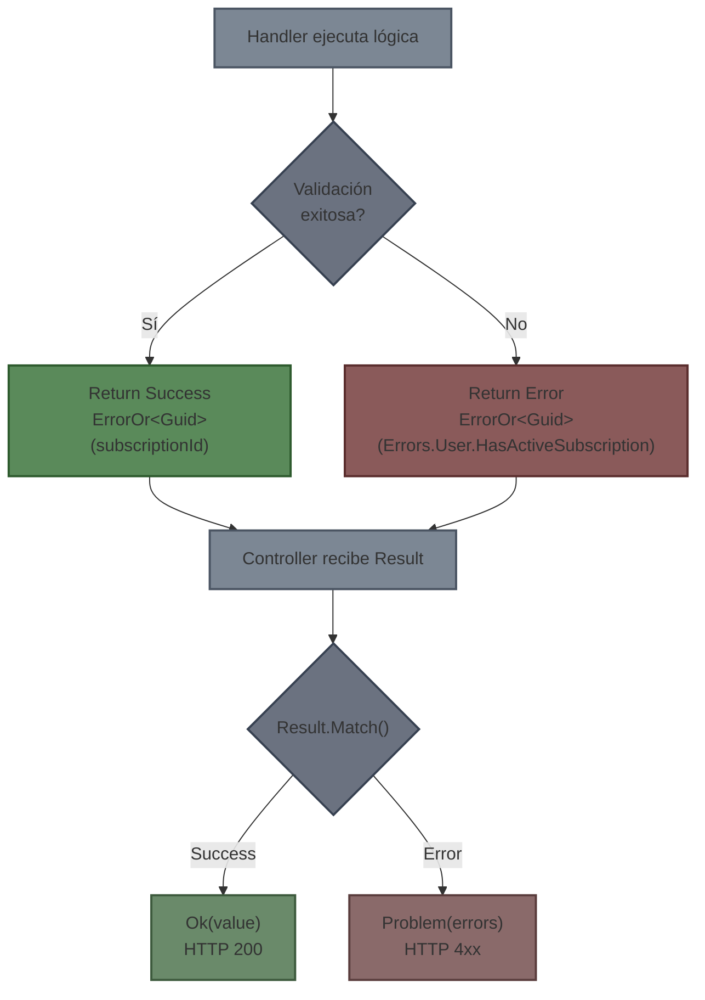

**Implementación conceptual:**

```
// En lugar de devolver int o lanzar excepción:
public async Task<ErrorOr<Guid>> Handle(...) 
{
    if (user.Subscriptions.Count > 0)
    {
        // Retornamos un objeto de error controlado
        return Errors.User.HasActiveSubscription;
    }
    
    // ... lógica ...
    return subscription.Id;
}

// En el Controller:
var result = await _mediator.Send(command);

return result.Match(
    value => Ok(value),
    errors => Problem(errors) // Mapea el error a un código HTTP correcto (409, 404, etc.)
);

```

### Repository Pattern

Abstracción entre el Dominio/Aplicación y la Base de Datos.

-   **Interfaz (`IRepository`):** Vive en la capa de **Dominio** (o Aplicación).
    
-   **Implementación (`Repository`):** Vive en la capa de **Infraestructura**.
    
-   **Ventajas:** Facilita el Unit Testing (podemos mockear la BD) y permite cambiar la tecnología de persistencia sin tocar la lógica de negocio.

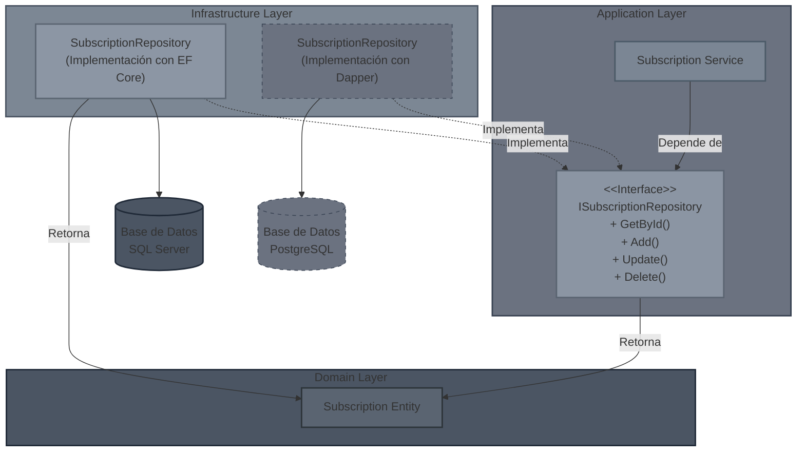
    

### Unit of Work Pattern

Este patrón actúa como un "director de orquesta" para las transacciones de base de datos, resolviendo problemas de integridad cuando una operación de negocio involucra cambios en múltiples agregados o repositorios.

**El Problema: Inconsistencia Parcial**
Imagina el escenario: **"Crear una suscripción y actualizar el estado del gimnasio"**. Sin Unit of Work, si las operaciones guardan cambios individualmente:

1.  `_subscriptionRepo.Add(sub)` $\rightarrow$ **Éxito (Guardado en BD)**.
2.  `_gymRepo.Update(gym)` $\rightarrow$ **Fallo (Error de red/SQL)**.

**Resultado:** Tienes una suscripción huérfana para un gimnasio que no ha registrado el cambio. El sistema ha quedado en un estado inconsistente.

**La Solución: Atomicidad**
`UnitOfWork` asegura que todos los cambios se traten como una única transacción atómica (**ACID**).

  * **Todo tiene éxito:** Se persisten todos los cambios a la vez.
  * **Algo falla:** No se guarda nada (Rollback automático).

<!-- end list -->

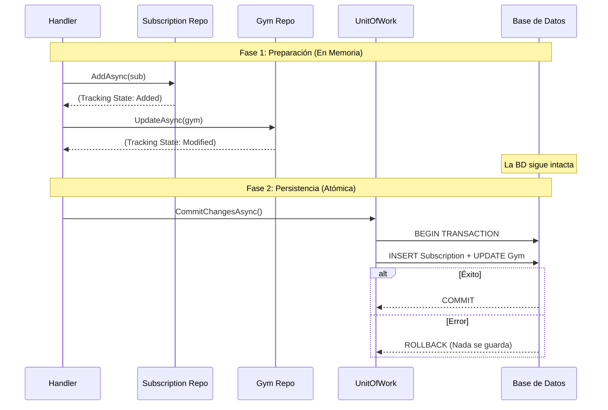

**Ejemplo de Implementación Robusta:**

En este patrón, los repositorios **no llaman a `SaveChanges`**. Solo marcan las entidades como "agregadas", "modificadas" o "eliminadas" en el contexto compartido.

```csharp
public async Task<ErrorOr<Guid>> Handle(CreateSubscriptionCommand command)
{
    // 1. Lógica de Dominio y Validaciones
    var gym = await _gymRepo.GetByIdAsync(command.GymId);
    if (gym is null) return Errors.Gym.NotFound;

    var sub = new Subscription(command.UserId, command.PlanId);

    // Actualizamos el agregado Gym (Lógica en memoria)
    var result = gym.AddSubscription(sub);
    if (result.IsError) return result.Errors;

    try 
    {
        // 2. Preparación de la persistencia
        // Estos métodos NO impactan la BD, solo avisan al Contexto
        await _subscriptionRepo.AddAsync(sub);
        await _gymRepo.UpdateAsync(gym);

        // 3. Commit (Punto de no retorno)
        // Se abre la transacción, se envían los cambios y se cierra.
        await _unitOfWork.CommitChangesAsync();

        return sub.Id;
    }
    catch (Exception)
    {
        // Si falla el Commit, nada se guardó. La integridad se mantiene.
        // Aquí podríamos loguear el error.
        return Errors.Subscription.CommitFailed;
    }
}
```

> **Nota de Arquitectura:** La interfaz `IUnitOfWork` se define en la capa de **Aplicación** (o Dominio), mientras que su implementación concreta (que inyecta el `DbContext` de EF Core) reside en la capa de **Infraestructura**, respetando la Regla de Dependencia.
>

## 6. Capa de infraestructura

### Responsabilidades

- Interactuar con la solución persistente. Ej: bases de datos SQL/NoSQL.
- Interactuar con otros servicios externos como servicios de email, pasarelas de pago, message brokers, etc.
- Interactuar con el sistema operativo (sistema de archivos, reloj del sistema, etc).
