# Clean Architecture - Apuntes de Curso

Este documento recopila y estructura los conceptos clave sobre Clean Architecture, basándose en el curso de _Dometrain_. Se centra en la separación de responsabilidades, la independencia de la base de datos y la mantenibilidad del software.

## 1. Evolución de los Patrones de Arquitectura

Antes de llegar a Clean Architecture, es importante entender de dónde venimos y qué problemas intentamos resolver. La arquitectura de software ha evolucionado significativamente a lo largo de las décadas, buscando soluciones a los desafíos de escalabilidad, mantenibilidad y complejidad creciente de los sistemas.

### Principales Patrones de Arquitectura

#### **N-Tier / Layered Architecture (Arquitectura por Capas)**

La arquitectura clásica por capas fue durante mucho tiempo el estándar de facto. Organiza el código en capas horizontales (Presentación, Lógica de Negocio, Acceso a Datos), donde cada capa solo puede comunicarse con la capa inmediatamente inferior. Aunque simple de entender, tiene limitaciones importantes que veremos más adelante.

```mermaid
graph TD
    UI[Capa de Presentación<br/>UI / Controllers] --> BL[Capa de Lógica de Negocio<br/>Business Logic]
    BL --> DAL[Capa de Acceso a Datos<br/>Data Access Layer]
    DAL --> DB[(Base de Datos)]

    style UI fill:#7c8794,stroke:#4b5563,stroke-width:2px
    style BL fill:#6b7280,stroke:#374151,stroke-width:2px
    style DAL fill:#5a6471,stroke:#2d3439,stroke-width:2px
    style DB fill:#4b5563,stroke:#1f2937,stroke-width:2px
```



**Ventajas:** Separación clara de responsabilidades, fácil de entender.  
**Desventajas:** Dependencias rígidas hacia abajo, la base de datos se convierte en el centro, difícil de testear.

#### **Microservices Architecture (Arquitectura de Microservicios)**

Divide la aplicación en servicios pequeños, independientes y desplegables por separado. Cada microservicio posee su propia base de datos y se comunica con otros a través de APIs (REST, gRPC, mensajería).


**Ventajas:** Escalabilidad independiente, tecnologías heterogéneas, equipos autónomos.  
**Desventajas:** Complejidad operacional, transacciones distribuidas, consistencia eventual.

#### **Service-Oriented Architecture (SOA)**

Precursor de los microservicios, SOA organiza la funcionalidad en servicios reutilizables que se comunican mediante protocolos estándar (SOAP, XML). A diferencia de los microservicios, SOA tiende a tener servicios más grandes y mayor acoplamiento a través de un Enterprise Service Bus (ESB).


**Ventajas:** Reutilización de servicios, integración empresarial.  
**Desventajas:** ESB como punto único de fallo, complejidad en la orquestación.

#### **Modular Monolith (Monolito Modular)**

Un enfoque híbrido que mantiene todos los módulos en un solo proceso (monolito) pero con límites claros y bien definidos entre módulos. Es un paso intermedio hacia los microservicios sin su complejidad operacional.

```mermaid
graph TD
    subgraph Monolith[Aplicación Monolítica]
        M1[Módulo Users<br/>API bien definida]
        M2[Módulo Orders<br/>API bien definida]
        M3[Módulo Payments<br/>API bien definida]
        M4[Módulo Notifications<br/>API bien definida]
    end

    M1 -.Interfaz.-> M2
    M2 -.Interfaz.-> M3
    M3 -.Interfaz.-> M4

    Monolith --> DB[(Base de Datos<br/>Compartida)]

    style Monolith fill:#5a6471,stroke:#2d3439,stroke-width:3px
    style M1 fill:#7c8794,stroke:#4b5563,stroke-width:2px
    style M2 fill:#7c8794,stroke:#4b5563,stroke-width:2px
    style M3 fill:#7c8794,stroke:#4b5563,stroke-width:2px
    style M4 fill:#7c8794,stroke:#4b5563,stroke-width:2px
    style DB fill:#4b5563,stroke:#1f2937,stroke-width:2px
```



**Ventajas:** Simplicidad de despliegue, transacciones ACID, refactorización más sencilla.  
**Desventajas:** Escalado vertical, posible degradación hacia un "big ball of mud" si no se mantiene la disciplina.

#### **Event Driven Architecture (Arquitectura Basada en Eventos)**

Los componentes se comunican mediante eventos asíncronos. Un productor publica eventos y los consumidores reaccionan a ellos sin conocerse mutuamente. Muy útil en sistemas reactivos y de alta concurrencia.

```mermaid
graph LR
    P1[Producer 1] -->|Publica Evento| EB[Event Bus<br/>RabbitMQ/Kafka]
    P2[Producer 2] -->|Publica Evento| EB

    EB -->|Suscripción| C1[Consumer 1]
    EB -->|Suscripción| C2[Consumer 2]
    EB -->|Suscripción| C3[Consumer 3]

    C1 --> DB1[(DB 1)]
    C2 --> DB2[(DB 2)]
    C3 --> DB3[(DB 3)]

    style P1 fill:#7c8794,stroke:#4b5563,stroke-width:2px
    style P2 fill:#7c8794,stroke:#4b5563,stroke-width:2px
    style EB fill:#6b7280,stroke:#374151,stroke-width:3px
    style C1 fill:#7c8794,stroke:#4b5563,stroke-width:2px
    style C2 fill:#7c8794,stroke:#4b5563,stroke-width:2px
    style C3 fill:#7c8794,stroke:#4b5563,stroke-width:2px
    style DB1 fill:#4b5563,stroke:#1f2937,stroke-width:2px
    style DB2 fill:#4b5563,stroke:#1f2937,stroke-width:2px
    style DB3 fill:#4b5563,stroke:#1f2937,stroke-width:2px
```



**Ventajas:** Desacoplamiento temporal, escalabilidad, resiliencia.  
**Desventajas:** Debugging complejo, eventual consistency, gestión de sagas.

#### **MV Patterns (MVC, MVP, MVVM)**

Patrones de presentación que separan la lógica de interfaz de usuario de la lógica de negocio:

- **MVC (Model-View-Controller):** El controlador maneja la entrada del usuario, actualiza el modelo y selecciona la vista.
- **MVP (Model-View-Presenter):** El presentador actúa como intermediario entre vista y modelo, haciendo la vista más pasiva.
- **MVVM (Model-View-ViewModel):** El ViewModel expone datos del modelo en un formato que la vista puede enlazar fácilmente (data binding).


Estos patrones son complementarios a las arquitecturas de sistema y se enfocan específicamente en la capa de presentación.

### El problema de la Arquitectura por Capas (N-Tier)

En la arquitectura tradicional de 3 capas (Tier 1, 2, 3), las dependencias fluyen hacia abajo, generalmente terminando en la base de datos.


**El gran inconveniente:** Todas las flechas acaban apuntando a la Base de Datos. Con el tiempo, esto provoca que el acceso a datos se mezcle con la lógica de negocio e incluso con la presentación. Los **DATOS** se convierten en el centro de la arquitectura, en lugar de serlo la **LÓGICA DE NEGOCIO**.

## 2. Arquitecturas Centradas en el Dominio

El objetivo de las arquitecturas modernas es invertir las dependencias. Queremos que la **Lógica de Negocio (Dominio)** sea el núcleo y no dependa de nada externo (ni UI, ni BD, ni Frameworks).

Variantes principales:

- **Clean Architecture** (Robert C. Martin)
- Hexagonal Architecture (Ports and Adapters)
- Onion Architecture

### Estructura de Clean Architecture

Las capas interiores definen interfaces (el "qué") y las capas exteriores definen la implementación (el "cómo").

```mermaid
graph TD
    subgraph Infrastructure [Capa Infraestructura]
        DB[(Base de Datos)]
        Ext[Servicios Externos]
    end

    subgraph Presentation [Capa Presentación]
        UI[API / Web / Consola]
    end

    subgraph Core [Núcleo de la Aplicación]
        Application[Capa Aplicación]
        Domain[Capa Dominio]
    end

    %% Dependencias (Corregido: Conectar Nodos en vez de Subgraphs)
    UI --> Application
    DB --> Application
    Ext --> Application
    Application --> Domain
    DB --> Domain

    %% Estilos
    style Application fill:#6b7280,stroke:#374151,stroke-width:2px
    style Domain fill:#4b5563,stroke:#1f2937,stroke-width:2px
    style Infrastructure fill:#7c8794,stroke:#4b5563,stroke-width:2px
    style Presentation fill:#7c8794,stroke:#4b5563,stroke-width:2px
```



> **Regla de Dependencia:** El código fuente solo puede apuntar hacia adentro. El Dominio no sabe nada de la Infraestructura.

## 3. Desglose de Capas

Este diagrama ilustra la relación entre las capas lógicas y la estructura física de proyectos recomendada en el curso (Sección 0020), destacando la separación de los contratos.

## 🏗️ Clean Architecture (Arquitectura Limpia)

Este diagrama representa la jerarquía y el flujo de dependencias de una aplicación bajo los principios de Arquitectura Limpia, donde las flechas apuntan **hacia dentro**, hacia las capas más estables y de alto nivel (el Dominio).

[Image of the Clean Architecture Onion Diagram]


### A. Capa de Presentación (Presentation Layer)

Es el punto de entrada al sistema.

- **Responsabilidades:** Interactuar con el exterior, visualizar datos, traducir datos (DTOs) y administrar la configuración del framework (ej. ASP.NET Core).
- **Estructura:** Se recomienda separar los contratos (Requests/Responses) en un proyecto o librería aparte.

**¿Por qué separar los contratos?** Permite empaquetar `Contracts` (ej. un paquete NuGet) para que los clientes (Frontend, otros microservicios) puedan consumirlos sin depender de la API completa.

**Ejemplo de Estructura:**

- `GymManagement.Api` (Proyecto WebAPI)
- `GymManagement.Contracts` (Class Library - Solo DTOs)

### B. Capa de Aplicación (Application Layer)

Contiene la lógica de los casos de uso. Orquesta el flujo de información.

- **Responsabilidades:**

  1.  Ejecutar casos de uso.
  2.  Obtener objetos del Dominio (Fetch).
  3.  Manipular objetos del Dominio (Lógica de negocio pura).
  4.  Guardar cambios (Persistencia).

### C. Capa de Infraestructura (Infrastructure Layer)

Se encarga de todo lo que es "detalle de implementación" y comunicación con el mundo físico.

- Base de datos (EF Core, Dapper).
- Servicios externos (Stripe, SendGrid).
- Sistema de archivos, Reloj del sistema, etc.

## 4. Inyección de Dependencias (DI) en Clean Arch

Existe un desafío: La API (Presentación) necesita inyectar servicios definidos en `Application` pero implementados en `Infrastructure`. Sin embargo, para mantener la arquitectura limpia, no deberíamos acoplar fuertemente la API a la Infraestructura.

**Solución: Extension Methods para DI** Cada capa es responsable de definir su propia inyección de dependencias.


> **Principio clave:** La API (Composition Root) es el único lugar que conoce todas las capas. Cada capa registra sus propias dependencias a través de Extension Methods, manteniendo la separación de responsabilidades.

#### 1. En la capa de Aplicación (`DependencyInjection.cs`)

```csharp
// Proyecto: Application
using Microsoft.Extensions.DependencyInjection;

public static class DependencyInjection
{
    public static IServiceCollection AddApplication(this IServiceCollection services)
    {
        // Registrar servicios propios de la capa de aplicación
        services.AddScoped<ISubscriptionService, SubscriptionService>();

        // Registrar MediatR u otros validadores aquí
        return services;
    }
}

```

#### 2. En la capa de Infraestructura (`DependencyInjection.cs`)

```csharp
// Proyecto: Infrastructure
using Microsoft.Extensions.DependencyInjection;

public static class DependencyInjection
{
    public static IServiceCollection AddInfrastructure(this IServiceCollection services)
    {
        // Aquí es donde la implementación concreta se une a la interfaz
        services.AddScoped<ISubscriptionRepository, SubscriptionRepository>();
        services.AddScoped<IEmailSender, SendGridEmailSender>();

        return services;
    }
}

```

#### 3. En la API (`Program.cs`)

El punto de entrada es el único lugar donde se permite "conocer" todas las capas para ensamblarlas.

```csharp
var builder = WebApplication.CreateBuilder(args);

// Una sola línea por capa mantiene el Program.cs limpio
builder.Services
    .AddApplication()
    .AddInfrastructure();

var app = builder.Build();
app.Run();

```

#### A tener en cuenta:

> **¡OJO!** Se podría pensar que se viola el principio de responsabilidades únicas de las capas, ya que la capa de `INFRAESTRUCTURA` debe ser referenciada por la capa de `PRESENTACIÓN`, pero esto se hace únicamente por la inyección de dependencias. Se debe evitar a toda cosa utilizar cualquier otra referencia de la capa de infraestructura en la capa de presentación. Es por ello que se suele optar por soluciones como declarar pública la clase `DependencyInjection` e internal cualquier otra.

## 5. Patrones Tácticos

### CQRS (Command Query Responsibility Segregation)

Separa las operaciones de lectura de las de escritura.

- **Commands:** Escriben datos. Mutan el estado. Generalmente devuelven `void` o el ID del recurso creado.
- **Queries:** Leen datos. No mutan el estado. Devuelven datos (DTOs).

```mermaid
graph LR
    subgraph Write["Lado de Escritura (Commands)"]
        CMD[CreateCommand] --> CH[Command Handler]
        CH --> WM[Write Model]
        WM --> WDB[(Base de Datos<br/>Escritura)]
    end

    subgraph Read["Lado de Lectura (Queries)"]
        QRY[GetQuery] --> QH[Query Handler]
        QH --> RM[Read Model]
        RM --> RDB[(Base de Datos<br/>Lectura)]
    end

    Client[Cliente] -->|Escribe| CMD
    Client -->|Lee| QRY

    WDB -.Sincronización.-> RDB

    style Write fill:#6b7280,stroke:#374151,stroke-width:2px
    style Read fill:#7c8794,stroke:#4b5563,stroke-width:2px
    style CMD fill:#8b95a3,stroke:#5a6471,stroke-width:2px
    style QRY fill:#8b95a3,stroke:#5a6471,stroke-width:2px
    style CH fill:#7b8694,stroke:#4b5a67,stroke-width:2px
    style QH fill:#8c96a4,stroke:#5b6572,stroke-width:2px
    style WDB fill:#4b5563,stroke:#1f2937,stroke-width:2px
    style RDB fill:#4b5563,stroke:#1f2937,stroke-width:2px
```



> **Nota:** No confundir con CQS (Command Query Separation) que es a nivel de método. CQRS es a nivel de arquitectura/objetos.

### Patrón Mediator

Desacopla los controladores de los servicios. El controlador envía un mensaje y un "mediador" busca quién debe manejarlo.

- Favorece: **Slice by Feature** (organizar carpetas por funcionalidad: `CreateSubscription`, `GetSubscription`) en lugar de por tipo técnico (`Controllers`, `Services`).

```mermaid
sequenceDiagram
    participant API as Controller
    participant M as Mediator
    participant H as Handler
    participant D as Domain/DB

    API->>M: Send(CreateSubscriptionCommand)
    M->>H: Localiza y ejecuta Handler
    H->>D: Ejecuta lógica de negocio
    D-->>H: Retorna resultado
    H-->>M: Retorna respuesta
    M-->>API: Retorna respuesta

```



### Patrón Result

Evitar el uso de Excepciones para el flujo de control lógico. Las excepciones son para errores inesperados. Para validaciones o reglas de negocio, usamos un objeto `Result` (o bibliotecas como `ErrorOr`).

```mermaid
graph TD
    Start[Handler ejecuta lógica] --> Validate{Validación<br/>exitosa?}

    Validate -->|Sí| Success["Return Success<br/>ErrorOr&lt;Guid&gt;(subscriptionId)"]
    Validate -->|No| Error["Return Error<br/>ErrorOr&lt;Guid&gt;(Errors.User.HasActiveSubscription)"]

    Success --> Controller[Controller recibe Result]
    Error --> Controller

    Controller --> Match{"Result.Match()"}

    Match -->|Success| OK["Ok(value)<br/>HTTP 200"]
    Match -->|Error| Problem["Problem(errors)<br/>HTTP 4xx"]

    style Start fill:#7c8794,stroke:#4b5563,stroke-width:2px
    style Validate fill:#6b7280,stroke:#374151,stroke-width:2px
    style Success fill:#5a8a5a,stroke:#2d5a2d,stroke-width:2px
    style Error fill:#8a5a5a,stroke:#5a2d2d,stroke-width:2px
    style Controller fill:#7c8794,stroke:#4b5563,stroke-width:2px
    style Match fill:#6b7280,stroke:#374151,stroke-width:2px
    style OK fill:#6a8a6a,stroke:#3d5a3d,stroke-width:2px
    style Problem fill:#8a6a6a,stroke:#5a3d3d,stroke-width:2px
```



**Implementación conceptual:**

```csharp
// En lugar de devolver int o lanzar excepción:
public async Task<ErrorOr<Guid>> Handle(...)
{
    if (user.Subscriptions.Count > 0)
    {
        // Retornamos un objeto de error controlado
        return Errors.User.HasActiveSubscription;
    }

    // ... lógica ...
    return subscription.Id;
}

// En el Controller:
var result = await _mediator.Send(command);

return result.Match(
    value => Ok(value),
    errors => Problem(errors) // Mapea el error a un código HTTP correcto (409, 404, etc.)
);

```

### Repository Pattern

Abstracción entre el Dominio/Aplicación y la Base de Datos.

- **Interfaz (`IRepository`):** Vive en la capa de **Dominio** (o Aplicación).
- **Implementación (`Repository`):** Vive en la capa de **Infraestructura**.
- **Ventajas:** Facilita el Unit Testing (podemos mockear la BD) y permite cambiar la tecnología de persistencia sin tocar la lógica de negocio.


### Unit of Work Pattern

Este patrón actúa como un "director de orquesta" para las transacciones de base de datos, resolviendo problemas de integridad cuando una operación de negocio involucra cambios en múltiples agregados o repositorios.

**El Problema: Inconsistencia Parcial**
Imagina el escenario: **"Crear una suscripción y actualizar el estado del gimnasio"**. Sin Unit of Work, si las operaciones guardan cambios individualmente:

1.  `_subscriptionRepo.Add(sub)` $\rightarrow$ **Éxito (Guardado en BD)**.
2.  `_gymRepo.Update(gym)` $\rightarrow$ **Fallo (Error de red/SQL)**.

**Resultado:** Tienes una suscripción huérfana para un gimnasio que no ha registrado el cambio. El sistema ha quedado en un estado inconsistente.

**La Solución: Atomicidad**
`UnitOfWork` asegura que todos los cambios se traten como una única transacción atómica (**ACID**).

- **Todo tiene éxito:** Se persisten todos los cambios a la vez.
- **Algo falla:** No se guarda nada (Rollback automático).

<!-- end list -->


**Ejemplo de Implementación Robusta:**

En este patrón, los repositorios **no llaman a `SaveChanges`**. Solo marcan las entidades como "agregadas", "modificadas" o "eliminadas" en el contexto compartido.

```csharp
public async Task<ErrorOr<Guid>> Handle(CreateSubscriptionCommand command)
{
    // 1. Lógica de Dominio y Validaciones
    var gym = await _gymRepo.GetByIdAsync(command.GymId);
    if (gym is null) return Errors.Gym.NotFound;

    var sub = new Subscription(command.UserId, command.PlanId);

    // Actualizamos el agregado Gym (Lógica en memoria)
    var result = gym.AddSubscription(sub);
    if (result.IsError) return result.Errors;

    try
    {
        // 2. Preparación de la persistencia
        // Estos métodos NO impactan la BD, solo avisan al Contexto
        await _subscriptionRepo.AddAsync(sub);
        await _gymRepo.UpdateAsync(gym);

        // 3. Commit (Punto de no retorno)
        // Se abre la transacción, se envían los cambios y se cierra.
        await _unitOfWork.CommitChangesAsync();

        return sub.Id;
    }
    catch (Exception)
    {
        // Si falla el Commit, nada se guardó. La integridad se mantiene.
        // Aquí podríamos loguear el error.
        return Errors.Subscription.CommitFailed;
    }
}
```

> **Nota de Arquitectura:** La interfaz `IUnitOfWork` se define en la capa de **Aplicación** (o Dominio), mientras que su implementación concreta (que inyecta el `DbContext` de EF Core) reside en la capa de **Infraestructura**, respetando la Regla de Dependencia.

## 6. Capa de infraestructura

### Responsabilidades

- Interactuar con la solución persistente. Ej: bases de datos SQL/NoSQL.
- Interactuar con otros servicios externos como servicios de email, pasarelas de pago, message brokers, etc.
- Interactuar con el sistema operativo (sistema de archivos, reloj del sistema, etc).

### Implementación de Entity Framework Core

Entity Framework Core (EF Core) es un ORM (Object-Relational Mapper) que permite trabajar con bases de datos relacionales usando objetos .NET. En Clean Architecture, EF Core se implementa exclusivamente en la capa de **Infraestructura**.

#### El DbContext

El `DbContext` es el punto de entrada principal de EF Core. Representa una sesión con la base de datos y permite consultar y guardar entidades.

```csharp
// Infrastructure/Persistence/GymManagementDbContext.cs
public class GymManagementDbContext : DbContext
{
    public GymManagementDbContext(DbContextOptions<GymManagementDbContext> options)
        : base(options)
    {
    }

    public DbSet<Subscription> Subscriptions => Set<Subscription>();
    public DbSet<Gym> Gyms => Set<Gym>();
    public DbSet<Room> Rooms => Set<Room>();

    protected override void OnModelCreating(ModelBuilder modelBuilder)
    {
        // Aplicar todas las configuraciones del ensamblado actual
        modelBuilder.ApplyConfigurationsFromAssembly(typeof(GymManagementDbContext).Assembly);

        base.OnModelCreating(modelBuilder);
    }
}
```

**Registro en DependencyInjection.cs:**

```csharp
public static IServiceCollection AddInfrastructure(
    this IServiceCollection services,
    IConfiguration configuration)
{
    services.AddDbContext<GymManagementDbContext>(options =>
        options.UseSqlServer(configuration.GetConnectionString("DefaultConnection")));

    services.AddScoped<ISubscriptionRepository, SubscriptionRepository>();
    services.AddScoped<IUnitOfWork, UnitOfWork>();

    return services;
}
```

#### Configuración de Modelos

Las configuraciones separan el mapeo EF Core del modelo de dominio, manteniendo el dominio limpio. Se implementan mediante `IEntityTypeConfiguration<T>`.

```csharp
// Infrastructure/Persistence/Configurations/SubscriptionConfiguration.cs
public class SubscriptionConfiguration : IEntityTypeConfiguration<Subscription>
{
    public void Configure(EntityTypeBuilder<Subscription> builder)
    {
        // Configurar clave primaria
        builder.HasKey(s => s.Id);

        // Generación de IDs
        builder.Property(s => s.Id)
            .ValueGeneratedNever(); // El dominio genera el GUID

        // Propiedades requeridas
        builder.Property(s => s.Type)
            .IsRequired()
            .HasConversion<string>(); // Enum como string en BD

        // Propiedades que son enums
        builder.Property(s => s.SubscriptionType)
            .HasConversion(
                subscriptionType => subscriptionType.ToString(),               // A BD
                value => (SubscriptionType)Enum.Parse(typeof(SubscriptionType), value) // De BD
            );

        // Configurar campo privado (para EF Core)
        builder.Property("_adminId")
            .HasColumnName("AdminId")
            .IsRequired();

        // Relaciones
        builder.HasOne<Gym>()
            .WithMany()
            .HasForeignKey("_gymId")
            .OnDelete(DeleteBehavior.Cascade);

        // Índices para rendimiento
        builder.HasIndex("_adminId");

        // Nombre de tabla
        builder.ToTable("Subscriptions");
    }
}
```

**Configuraciones Comunes:**

```csharp
// 1. Generación de IDs
builder.Property(e => e.Id)
    .ValueGeneratedNever();           // El dominio genera (GUID)
    // .ValueGeneratedOnAdd();        // BD genera al insertar (IDENTITY)
    // .HasDefaultValueSql("NEWID()"); // BD genera con función SQL

// 2. Propiedades de auditoría
builder.Property(e => e.CreatedAt)
    .HasDefaultValueSql("GETUTCDATE()");

// 3. Precisión de decimales (ej. precios)
builder.Property(s => s.Price)
    .HasPrecision(18, 2);

// 4. Longitud máxima de strings
builder.Property(g => g.Name)
    .HasMaxLength(100)
    .IsRequired();

// 5. Conversión de Value Objects
builder.OwnsOne(g => g.Address, address =>
{
    address.Property(a => a.Street).HasColumnName("Street");
    address.Property(a => a.City).HasColumnName("City");
});

// 6. Configurar colecciones privadas
builder.HasMany<Room>()
    .WithOne()
    .HasForeignKey(r => r.GymId)
    .Metadata.PrincipalToDependent
    .SetField("_rooms"); // Campo privado List<Room> _rooms
```

#### Implementación del Repositorio

```csharp
// Infrastructure/Persistence/Repositories/SubscriptionRepository.cs
public class SubscriptionRepository : ISubscriptionRepository
{
    private readonly GymManagementDbContext _context;

    public SubscriptionRepository(GymManagementDbContext context)
    {
        _context = context;
    }

    public async Task<Subscription?> GetByIdAsync(Guid id)
    {
        return await _context.Subscriptions
            .FirstOrDefaultAsync(s => s.Id == id);
    }

    public async Task AddAsync(Subscription subscription)
    {
        await _context.Subscriptions.AddAsync(subscription);
        // NO llamar SaveChanges aquí (lo hace UnitOfWork)
    }

    public Task UpdateAsync(Subscription subscription)
    {
        _context.Subscriptions.Update(subscription);
        return Task.CompletedTask;
    }
}
```

#### Implementación del Unit of Work

```csharp
// Infrastructure/Persistence/UnitOfWork.cs
public class UnitOfWork : IUnitOfWork
{
    private readonly GymManagementDbContext _context;

    public UnitOfWork(GymManagementDbContext context)
    {
        _context = context;
    }

    public async Task CommitChangesAsync()
    {
        await _context.SaveChangesAsync();
    }
}
```

#### Migraciones

Las migraciones son versiones del esquema de la base de datos que permiten evolucionar el modelo sin perder datos.

**Concepto de Migraciones:**


**Flujo de Trabajo de Migraciones:**

```mermaid
sequenceDiagram
    participant Dev as Desarrollador
    participant Model as Modelo C#
    participant EF as EF Core
    participant Mig as Archivo Migración
    participant DB as Base de Datos

    Note over Dev,DB: Paso 1: Modificar el Modelo
    Dev->>Model: Añade propiedad Price a Subscription

    Note over Dev,DB: Paso 2: Crear Migración
    Dev->>EF: dotnet ef migrations add AddPrice
    EF->>Model: Compara modelo actual vs último snapshot
    EF->>Mig: Genera Up() y Down()
    Mig-->>Dev: Migración creada

    Note over Dev,DB: Paso 3: Revisar SQL (Opcional)
    Dev->>EF: dotnet ef migrations script
    EF-->>Dev: Muestra SQL que se ejecutará

    Note over Dev,DB: Paso 4: Aplicar Migración
    Dev->>EF: dotnet ef database update
    EF->>DB: Ejecuta Up() → ALTER TABLE ADD COLUMN
    DB-->>EF: Schema actualizado
    EF->>Mig: Guarda snapshot del estado actual
    EF-->>Dev: Base de datos actualizada

    Note over Dev,DB: Paso 5: Rollback (si es necesario)
    Dev->>EF: dotnet ef database update PreviousMigration
    EF->>DB: Ejecuta Down() → ALTER TABLE DROP COLUMN
    DB-->>EF: Schema revertido

    style Dev fill:#8b95a3,stroke:#5a6471,stroke-width:2px
    style Model fill:#7c8794,stroke:#4b5563,stroke-width:2px
    style EF fill:#6b7280,stroke:#374151,stroke-width:2px
    style Mig fill:#8c96a4,stroke:#5b6572,stroke-width:2px
    style DB fill:#4b5563,stroke:#1f2937,stroke-width:2px
```

**Comandos esenciales:**

```bash
# Crear una nueva migración
dotnet ef migrations add InitialCreate --project src/GymManagement.Infrastructure

# Actualizar la base de datos
dotnet ef database update --project src/GymManagement.Infrastructure

# Revertir migración
dotnet ef migrations remove --project src/GymManagement.Infrastructure

# Ver SQL que se ejecutará
dotnet ef migrations script --project src/GymManagement.Infrastructure
```

**Estructura de una Migración:**

```csharp
// Infrastructure/Persistence/Migrations/20240101_InitialCreate.cs
public partial class InitialCreate : Migration
{
    protected override void Up(MigrationBuilder migrationBuilder)
    {
        migrationBuilder.CreateTable(
            name: "Subscriptions",
            columns: table => new
            {
                Id = table.Column<Guid>(nullable: false),
                Type = table.Column<string>(nullable: false),
                AdminId = table.Column<Guid>(nullable: false),
                CreatedAt = table.Column<DateTime>(nullable: false, defaultValueSql: "GETUTCDATE()")
            },
            constraints: table =>
            {
                table.PrimaryKey("PK_Subscriptions", x => x.Id);
            });
    }

    protected override void Down(MigrationBuilder migrationBuilder)
    {
        migrationBuilder.DropTable(name: "Subscriptions");
    }
}
```

**Mejores Prácticas:**

- **Nombres descriptivos:** `AddGymCapacityColumn` en lugar de `Update1`.
- **Migraciones pequeñas:** Una migración por cambio lógico.
- **Revisar el SQL generado:** Antes de aplicar en producción.
- **Datos de prueba (Seeding):** Solo en Development, nunca en Production.

```csharp
// Seeding (solo para desarrollo)
protected override void OnModelCreating(ModelBuilder modelBuilder)
{
    modelBuilder.Entity<SubscriptionType>().HasData(
        new { Id = 1, Name = "Free" },
        new { Id = 2, Name = "Starter" },
        new { Id = 3, Name = "Pro" }
    );
}
```

> **Nota:** En Clean Architecture, el `DbContext` y las configuraciones viven en **Infraestructura**, pero las entidades del dominio se mantienen limpias y sin atributos de EF Core (como `[Key]` o `[Required]`). Toda la configuración se hace mediante Fluent API en clases separadas.

## 7. Domain Driven Design (DDD)

El Domain-Driven Design (DDD) es un enfoque que se centra en la lógica y los procesos del negocio (el "dominio") para crear soluciones complejas. Su objetivo es **alinear el software con el negocio**, dividiéndolo en subdominios y creando un modelo de dominio claro que guíe el diseño. Para lograr esto, se promueve un lenguaje común entre desarrolladores y expertos del negocio, y se utilizan patrones de diseño para reflejar la lógica del dominio en el código.

### ¿Por qué es importante DDD?

Hace desarrollo más sencillo, ya que busca que el software se parezca al negocio que representa. Facilita la comunicación entre desarrolladores y expertos del negocio, asegurando que todos entiendan los conceptos clave. Además, ayuda a manejar la complejidad dividiendo el dominio en partes más pequeñas y manejables.

### Modelos de Dominio (Domain Models)

Modelos que representan conceptos, reglas y lógica del negocio. Incluyen entidades, valores, agregados y servicios de dominio.

- **Entidades:** Objetos con identidad única (ej. Gym, Suscripción, etc.).
- **Objetos de Valor:** Objetos sin identidad propia, definidos por sus atributos (ej. Dirección, Dinero).
- **Agregados:** Conjuntos de entidades y objetos de valor que forman una unidad coherente (ej. Pedido con sus líneas de pedido).
- **Servicios de Dominio:** Operaciones que no encajan en entidades u objetos de valor (ej. Procesar pago).

Ejemplo de un modelo de dominio:

```csharp
public class Gym
{
    private readonly int _maxRooms = 3;
    private readonly List<Guid> _roomIds = new();

    public ErrorOr<Success> AddRoom(Room room)
    {
        if (_rooms.Contains(room.Id))
        {
            return Error.Conflict();
        }
        if (_rooms.Count > _maxRooms)
        {
            return Error.Validation();
        }
        _roomIds.Add(room.Id);
        return Result.Success;
    }
}
```

### Principios para un buen modelo de dominio

### Anemic Domain Model vs Rich Domain Model

- **Anemic Domain Model:** La lógica de negocio está fuera de las entidades, en servicios separados. Las entidades son simples contenedores de datos. Esto está considerado un antipatrón en DDD.
  Ejemplo:

```csharp
public class Gym
{
    public Guid Id { get; set; }
    public string Name { get; set; }
    public List<Guid> RoomIds { get; set; }
}

public class GymService
{
    public ErrorOr<Success> AddRoom(Gym gym, Room room)
    {
        if (gym.RoomIds.Contains(room.Id))
        {
            return Error.Conflict();
        }
        if (gym.RoomIds.Count > 3)
        {
            return Error.Validation();
        }
        gym.RoomIds.Add(room.Id);
        return Result.Success;
    }
}
```

- **Rich Domain Model:** La lógica de negocio está encapsulada dentro de las entidades y objetos de valor. Las entidades son responsables de su propio comportamiento y reglas.

Ejemplo:

```csharp
public class Gym
{
    private readonly int _maxRooms = 3;
    private readonly List<Guid> _roomIds = new();

    public ErrorOr<Success> AddRoom(Room room)
    {
        if (_rooms.Contains(room.Id))
        {
            return Error.Conflict();
        }
        if (_rooms.Count > _maxRooms)
        {
            return Error.Validation();
        }
        _roomIds.Add(room.Id);
        return Result.Success;
    }
}
```

Mejores prácticas para un modelo de dominio rico:

- Campos y propiedades privadas por defecto: cuando se añade un nuevo dato a la clase, si no necesito que sea público, lo declaro como `field`, si no necesito modificarlo, lo declaro como `readonly`.
- Exponer solo cuando se necesite: evitar exponer listas o colecciones directamente. En su lugar, proporcionar métodos para manipularlas (ej. `AddRoom`, `RemoveRoom`).
- Exponer solo lo que se necesite: evitar exponer propiedades o métodos que no son necesarios para el funcionamiento del dominio.

### _Always valid VS not always valid_

- **Always valid:** Las entidades siempre están en un estado válido. Las validaciones se realizan en los constructores o métodos de fábrica. Si no se cumplen las reglas, se lanza una excepción o se devuelve un error.
- **Not always valid:** Las entidades pueden estar en un estado inválido temporalmente. Las validaciones se realizan antes de ejecutar operaciones críticas (ej. guardar en la base de datos). Esto puede ser útil en escenarios donde se necesita construir objetos complejos paso a paso.

> En general, se recomienda el enfoque "always valid" para mantener la integridad del dominio, pero en algunos casos específicos, el enfoque "not always valid" puede ser más práctico.

Ejemplo de "always valid":

```csharp
public class Subscription
{
    public Guid UserId { get; }
    public Guid PlanId { get; }
    public DateTime StartDate { get; }

    public Subscription(Guid userId, Guid planId)
    {
        if (userId == Guid.Empty) throw new ArgumentException("UserId cannot be empty");
        if (planId == Guid.Empty) throw new ArgumentException("PlanId cannot be empty");

        UserId = userId;
        PlanId = planId;
        StartDate = DateTime.UtcNow;
    }
}
```

### Ignora la persistencia en el dominio

El modelo de dominio no debe contener detalles de persistencia (como Entity Framework Core, Dapper, etc.). La lógica de negocio debe estar separada de la forma en que los datos se almacenan o recuperan. Esto permite que el dominio sea independiente de la tecnología de persistencia y facilita las pruebas unitarias.

Esto no solo ocurre en la capa de dominio, sino también en la capa de aplicación. Ninguna de estas capas debe tener referencias directas a tecnologías de persistencia. En su lugar, deben depender de abstracciones (interfaces) que se implementan en la capa de infraestructura. Por ejemplo, un repositorio definido en la capa de aplicación o dominio, y su implementación concreta en la capa de infraestructura.

## Responsabilidades de la capa de Dominio

- Definir los **modelos** de dominio: entidades, objetos de valor, enums, agregados y servicios de dominio.
- Definir los **errores** y **excepciones** específicas del dominio.
- Ejecutar la **lógica de negocio** pura, sin depender de detalles de infraestructura o presentación.
- Asegurar que se cumplen las **reglas de negocio**

## Nota importante relacionada con la la capa de Dominio y la de infraestructura si se utiliza Entity Framework Core

Para que EF actualice correctamente las entidades en la base de datos, es necesario que las propiedades que representan las columnas de la tabla sean públicas y tengan tanto getters como setters. Esto puede entrar en conflicto con el principio de encapsulación del modelo de dominio, donde se busca mantener las propiedades privadas o protegidas para controlar el acceso y la modificación de los datos.

Si se desea mantener la integridad del modelo de dominio y al mismo tiempo cumplir con los requisitos de EF Core, una solución común es utilizar **constructores privados** y que todas las propiedades tengan getters públicos pero setters privados o protegidos. De esta manera, EF Core puede acceder a las propiedades para mapearlas a las columnas de la base de datos, pero el acceso desde fuera de la clase está controlado.

```csharp
public class Subscription
{
    public readonly Guid _adminId;

    // Propiedades que no tendrían setters, pero deben tenerlo para EF Core, luego se hacen privados
    public Guid Id { get; private set; }
    public SubscriptionType Type { get; private set; }

    public Subscription(Guid adminId, SubscriptionType type, Guid? id = null)
    {
        _adminId = adminId;
        Type = type;
        Id = id ?? Guid.NewGuid();
    }

```
